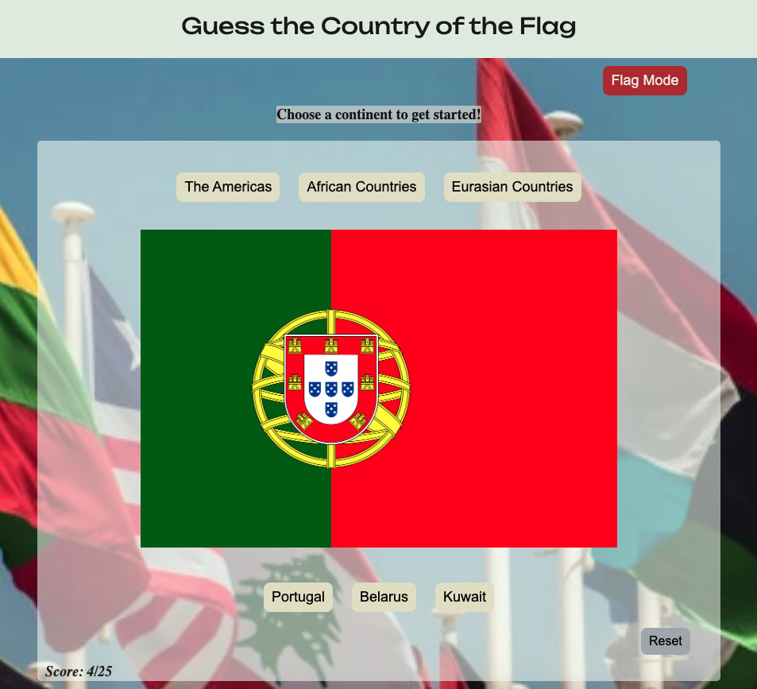

======*Guess the Country of the Flag*======
---

##`Description:`

#####Guess the Country of the Flag a trivia game. To play the game, first select one of the three major continents: The Americas, Africa, and/or Eurasia(a combination of European & Asian countries), and then a flag from that continent will appear with three different country options to choose from. Score of the correct answer is tracked and a message will appear at the end based on how well you scored. Guess the Country of the Flag was inspired from watching street videos of people getting asked what country a flag was from and a personal interest to build/create a game that is fun and educational at the same time.

---
###[Play Game Here](https://guess-the-country-flag-kb.netlify.app/)
___
##`Technologies Used 💾`
___

* 
* 
* 
* CSS
* HTML

***
##`Credits`

* Check out all my [Attributions](https://docs.google.com/document/d/1oDASCxQHmfdUwSc_EJesbAEvx6MOadVKc9lukSuPiNE/edit?usp=sharing).

##`Ice Box`

* Display feedbackMessage function
* Fix Functionality of back button 
* Longterm - work on randomizing answer options
* Work on css to better introduce the game at initial visit

